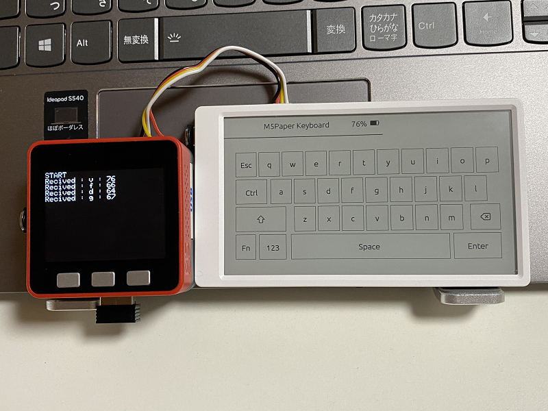
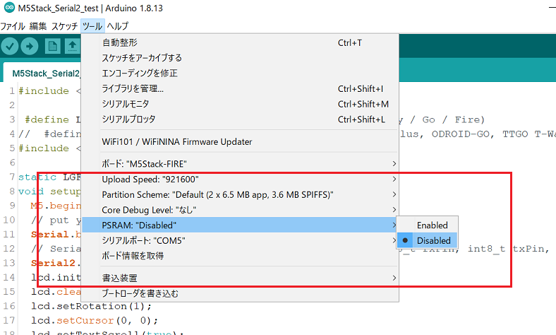
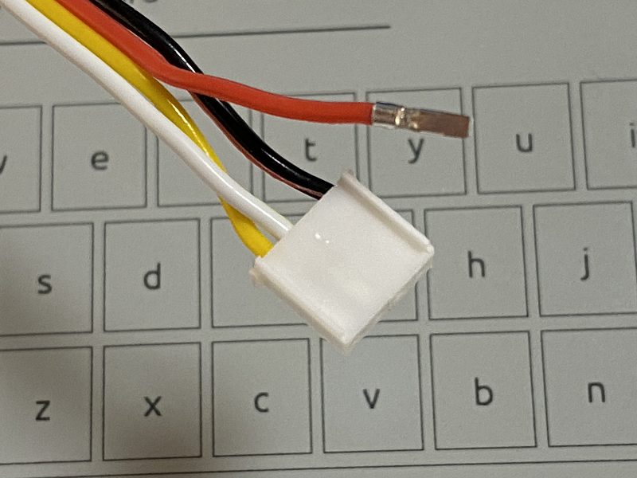
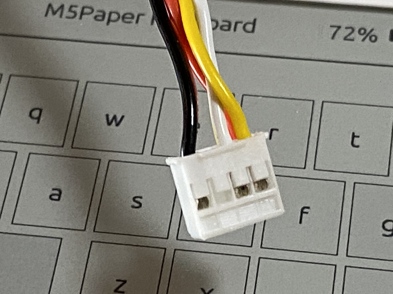

# M5Paper_Keyboard
M5Paper_Keyboardは、M5Paperで動くシリアルI/Fのキーボードです。 
これは、M5Paper_FactoryTestのキーボードの処理を抜き出して改造したものです。  
ベースにしたオリジナルはこちら。 
M5Paper_FactoryTest <https://github.com/m5stack/M5Paper_FactoryTest> 

  

### 必要な物 ###
* [M5Paper](http://www.m5stack.com/ "Title") 
* Arduino IDE (1.8.13で動作確認をしました。) 
* [Arduino core for the ESP32](https://github.com/espressif/arduino-esp32 "Title")
* [M5Paper Library](https://github.com/m5stack/M5EPD "Title")
 

ライブラリはArduino IDEの[スケッチ | ライブラリをインクルード |ライブラリを管理...] からインストールすると簡単です。

### シリアルポートの仕様 ###
* M5PaperのPORT Cを使用します。設定は以下の通り。 
    // Serial2.begin(unsigned long baud, uint32_t config, int8_t rxPin, int8_t txPin, bool invert) 
    Serial2.begin(115200, SERIAL_8N1, 19, 18);

### 補足 ###
* 電源を切る場合は、M5Paperの裏側の”BATTERY OFF”ボタンを使用してください。 
* "Fn"キーは未使用ですので機能拡張等に使用してください。  

---

M5Paper_Keyboardの動作確認用のM5Stackプログラム(M5Stack_Serial2_test)を用意してあります。 

  

### 必要な物 ###
* [M5Stack](http://www.m5stack.com/ "Title") (Fireで動作確認をしました。) 
* Arduino IDE (1.8.13で動作確認をしました。) 
* [Arduino core for the ESP32](https://github.com/espressif/arduino-esp32 "Title") 
* [M5Stack Library](https://github.com/m5stack/M5Stack "Title")
* [LovyanGFXライブラリ](https://github.com/lovyan03/LovyanGFX "Title")

ライブラリはArduino IDEの[スケッチ | ライブラリをインクルード |ライブラリを管理...] からインストールすると簡単です。

### シリアルポートの仕様 ###
* M5StackのPORT Cを使用します。設定は以下の通り。 
    // Serial2.begin(unsigned long baud, uint32_t config, int8_t rxPin, int8_t txPin, bool invert) 
    Serial2.begin(115200, SERIAL_8N1, 16, 17);  
注意：M5Stack Fireを使用する場合はPSRAMを無効にする必要があります。  
  

---

### クロスケーブルの作り方 ###
* M5StackSerial2_testでM5StackとM5Paper_Keyboardを接続するにはクロスケーブルが必要です。 
赤のケーブル(電源）を抜き、白と黄色のケーブルをクロスさせます。  
  
* コネクタの爪の部分を尖った物で持ち上げてやればケーブルは簡単に抜けます。   
  
  

